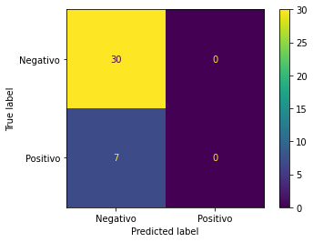

```python
from tratamento_module import *
from modelos_module import *
import numpy as np
import pandas as pd
import warnings
import importlib
from IPython.lib.deepreload import reload
from sklearn.metrics import plot_confusion_matrix
%load_ext autoreload
%autoreload 2

```

    The autoreload extension is already loaded. To reload it, use:
      %reload_ext autoreload
    


```python
warnings.filterwarnings("ignore")

tratamento = Tratamento()
```


```python
amostras = tratamento.amostras_import()
```


```python
amostras.head()
```


<div>
<style scoped>
    .dataframe tbody tr th:only-of-type {
        vertical-align: middle;
    }

    .dataframe tbody tr th {
        vertical-align: top;
    }

    .dataframe thead th {
        text-align: right;
    }
</style>
<table border="1" class="dataframe">
  <thead>
    <tr style="text-align: right;">
      <th>Wavelength</th>
      <th>350.0</th>
      <th>351.0</th>
      <th>352.0</th>
      <th>353.0</th>
      <th>354.0</th>
      <th>355.0</th>
      <th>356.0</th>
      <th>357.0</th>
      <th>358.0</th>
      <th>359.0</th>
      <th>...</th>
      <th>1364.0</th>
      <th>1365.0</th>
      <th>1366.0</th>
      <th>1367.0</th>
      <th>1368.0</th>
      <th>1369.0</th>
      <th>1370.0</th>
      <th>1371.0</th>
      <th>1372.0</th>
      <th>Diagnostico</th>
    </tr>
  </thead>
  <tbody>
    <tr>
      <th>A3791_e</th>
      <td>0.023225</td>
      <td>0.023256</td>
      <td>0.023233</td>
      <td>0.022841</td>
      <td>0.020918</td>
      <td>0.020383</td>
      <td>0.020697</td>
      <td>0.020925</td>
      <td>0.020588</td>
      <td>0.020506</td>
      <td>...</td>
      <td>0.005530</td>
      <td>0.005461</td>
      <td>0.005387</td>
      <td>0.005297</td>
      <td>0.005223</td>
      <td>0.005154</td>
      <td>0.005089</td>
      <td>0.005030</td>
      <td>0.004977</td>
      <td>Positivo</td>
    </tr>
    <tr>
      <th>A3792_e</th>
      <td>0.011012</td>
      <td>0.009415</td>
      <td>0.009336</td>
      <td>0.010466</td>
      <td>0.010308</td>
      <td>0.009649</td>
      <td>0.009095</td>
      <td>0.008971</td>
      <td>0.009065</td>
      <td>0.009404</td>
      <td>...</td>
      <td>0.002891</td>
      <td>0.002791</td>
      <td>0.002685</td>
      <td>0.002567</td>
      <td>0.002467</td>
      <td>0.002370</td>
      <td>0.002278</td>
      <td>0.002197</td>
      <td>0.002121</td>
      <td>Positivo</td>
    </tr>
    <tr>
      <th>A3793_e</th>
      <td>0.022587</td>
      <td>0.022717</td>
      <td>0.022223</td>
      <td>0.020916</td>
      <td>0.019812</td>
      <td>0.018976</td>
      <td>0.018413</td>
      <td>0.017999</td>
      <td>0.017348</td>
      <td>0.017177</td>
      <td>...</td>
      <td>0.004460</td>
      <td>0.004216</td>
      <td>0.003982</td>
      <td>0.003744</td>
      <td>0.003521</td>
      <td>0.003313</td>
      <td>0.003111</td>
      <td>0.002912</td>
      <td>0.002729</td>
      <td>Positivo</td>
    </tr>
    <tr>
      <th>A3797_e</th>
      <td>0.028283</td>
      <td>0.026276</td>
      <td>0.025200</td>
      <td>0.025143</td>
      <td>0.023914</td>
      <td>0.023573</td>
      <td>0.023126</td>
      <td>0.021963</td>
      <td>0.021399</td>
      <td>0.020641</td>
      <td>...</td>
      <td>0.003192</td>
      <td>0.003058</td>
      <td>0.002933</td>
      <td>0.002817</td>
      <td>0.002703</td>
      <td>0.002600</td>
      <td>0.002496</td>
      <td>0.002390</td>
      <td>0.002304</td>
      <td>Positivo</td>
    </tr>
    <tr>
      <th>A3798_e</th>
      <td>0.024692</td>
      <td>0.023229</td>
      <td>0.022823</td>
      <td>0.022822</td>
      <td>0.021488</td>
      <td>0.020784</td>
      <td>0.020383</td>
      <td>0.019904</td>
      <td>0.019754</td>
      <td>0.019565</td>
      <td>...</td>
      <td>0.004339</td>
      <td>0.004128</td>
      <td>0.003919</td>
      <td>0.003715</td>
      <td>0.003523</td>
      <td>0.003337</td>
      <td>0.003151</td>
      <td>0.002971</td>
      <td>0.002806</td>
      <td>Positivo</td>
    </tr>
  </tbody>
</table>
<p>5 rows × 1024 columns</p>
</div>


```python
amostra_freq = tratamento.get_frequencies(amostras=amostras,freq=[900.0,1000.0,1100.0,'Diagnostico'])        


```


```python
amostra_freq.shape
```


    (365, 4)


```python
X,y = Tratamento.get_samples(Tratamento,amostras=amostra_freq)
X_train,X_test,y_train,y_teste = Tratamento.training_test(Tratamento)
```


```python
X_test.head()
```


<div>
<style scoped>
    .dataframe tbody tr th:only-of-type {
        vertical-align: middle;
    }

    .dataframe tbody tr th {
        vertical-align: top;
    }

    .dataframe thead th {
        text-align: right;
    }
</style>
<table border="1" class="dataframe">
  <thead>
    <tr style="text-align: right;">
      <th>Wavelength</th>
      <th>900.0</th>
      <th>1000.0</th>
      <th>1100.0</th>
    </tr>
  </thead>
  <tbody>
    <tr>
      <th>A3168_e</th>
      <td>0.422121</td>
      <td>0.314203</td>
      <td>0.327425</td>
    </tr>
    <tr>
      <th>A2548</th>
      <td>0.429617</td>
      <td>0.251919</td>
      <td>0.138351</td>
    </tr>
    <tr>
      <th>A3244_c</th>
      <td>0.354856</td>
      <td>0.247393</td>
      <td>0.179036</td>
    </tr>
    <tr>
      <th>A2792</th>
      <td>0.133492</td>
      <td>0.077284</td>
      <td>0.061328</td>
    </tr>
    <tr>
      <th>A3785_c</th>
      <td>0.597544</td>
      <td>0.391515</td>
      <td>0.426199</td>
    </tr>
  </tbody>
</table>
</div>


```python
modelos = Modelos()
```


```python
clf_svm = modelos.SVM(X_train,y_train)
```


```python
y_teste.shape
```


    (37,)


```python
plot_confusion_matrix(clf_svm,X_test,y_teste,display_labels=['Negativo','Positivo'])
```


    <sklearn.metrics._plot.confusion_matrix.ConfusionMatrixDisplay at 0x26223420cf8>


    

    


```python
nn = Modelos.NN(Modelos,X_train,y_train)
```

    Train on 328 samples
    328/328 [==============================] - 0s 247us/sample - loss: 0.4584 - acc: 0.8567
    


```python
y_predict = nn.predict(X_test.to_numpy())
y_predict =  np.where(y_predict  > 0.8, 1, 0)
```


    ---------------------------------------------------------------------------

    ValueError                                Traceback (most recent call last)

    ~\AppData\Local\Temp\ipykernel_17980\2666386173.py in <module>
          1 y_predict = nn.predict(X_test.to_numpy())
    ----> 2 y_predict =  [1 if y_predict > 0.8 else 0 for i in y_predict]
    

    ~\AppData\Local\Temp\ipykernel_17980\2666386173.py in <listcomp>(.0)
          1 y_predict = nn.predict(X_test.to_numpy())
    ----> 2 y_predict =  [1 if y_predict > 0.8 else 0 for i in y_predict]
    

    ValueError: The truth value of an array with more than one element is ambiguous. Use a.any() or a.all()


```python
print(y_predict)
```

    [[0.12233434]
     [0.14454965]
     [0.09601983]
     [0.05331418]
     [0.17845728]
     [0.12307519]
     [0.1846591 ]
     [0.2425992 ]
     [0.14324473]
     [0.24438292]
     [0.0524053 ]
     [0.13760446]
     [0.1029557 ]
     [0.14904301]
     [0.13196225]
     [0.04016168]
     [0.08953942]
     [0.04291432]
     [0.16743301]
     [0.12837915]
     [0.13579781]
     [0.10452837]
     [0.14727008]
     [0.15109141]
     [0.18328767]
     [0.15013738]
     [0.31020132]
     [0.06078754]
     [0.07435106]
     [0.0638345 ]
     [0.05720014]
     [0.11450051]
     [0.13751693]
     [0.11014868]
     [0.18291213]
     [0.17337595]
     [0.04681817]]
    


```python
Tratamento.confusion(Tratamento,y_teste,y_predict)
```


    ---------------------------------------------------------------------------

    ValueError                                Traceback (most recent call last)

    ~\AppData\Local\Temp\ipykernel_17980\3896479208.py in <module>
    ----> 1 Tratamento.confusion(Tratamento,y_teste,y_predict)
    

    c:\Users\sodre\Estocasticos\tratamento_module.py in confusion(self, y_true, y_predict)
         49 
         50     def confusion(self,y_true,y_predict):
    ---> 51         cm = confusion_matrix(y_true,y_predict)
         52         fig,ax = plt.subplots(figsize = (7.5,7,5))
         53         ax.matshow(cm, cmap=plt.cm.Blues, alpha=0.3)
    

    ~\anaconda3\envs\TCC\lib\site-packages\sklearn\metrics\_classification.py in confusion_matrix(y_true, y_pred, labels, sample_weight, normalize)
        305     (0, 2, 1, 1)
        306     """
    --> 307     y_type, y_true, y_pred = _check_targets(y_true, y_pred)
        308     if y_type not in ("binary", "multiclass"):
        309         raise ValueError("%s is not supported" % y_type)
    

    ~\anaconda3\envs\TCC\lib\site-packages\sklearn\metrics\_classification.py in _check_targets(y_true, y_pred)
         93         raise ValueError(
         94             "Classification metrics can't handle a mix of {0} and {1} targets".format(
    ---> 95                 type_true, type_pred
         96             )
         97         )
    

    ValueError: Classification metrics can't handle a mix of binary and continuous targets

