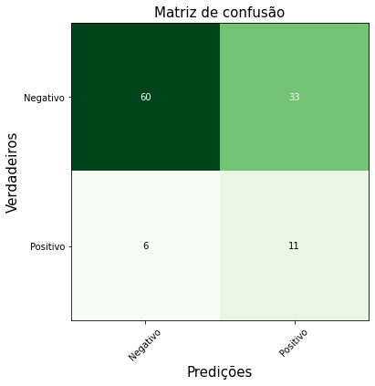
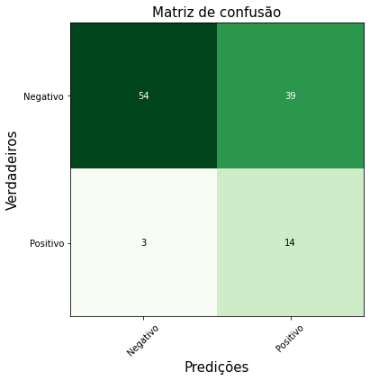
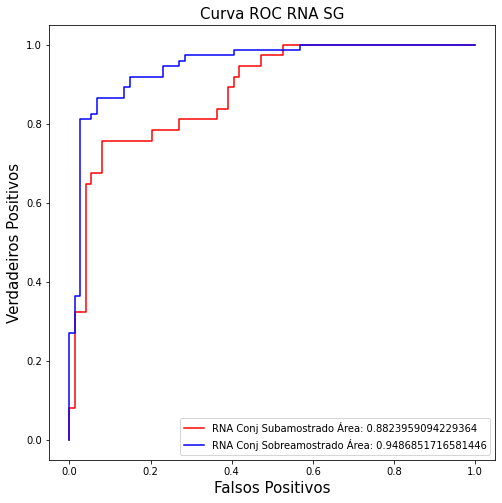
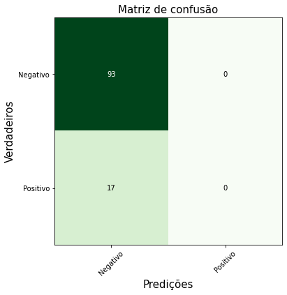
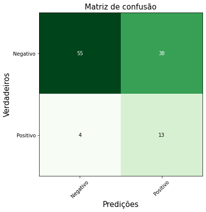
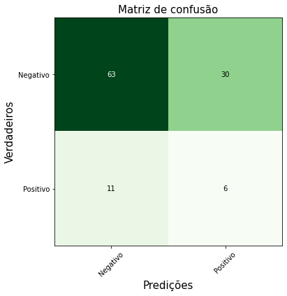
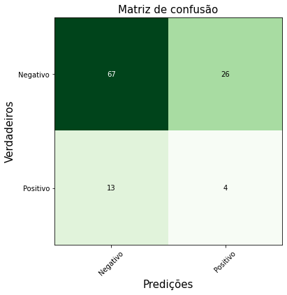
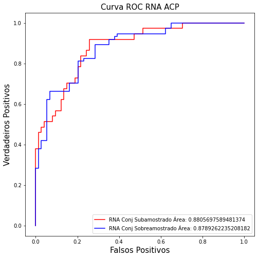

```python
from tratamento_module import *
from modelos_module import *
import numpy as np
import pandas as pd
import warnings
import importlib
from IPython.lib.deepreload import reload
from sklearn.metrics import plot_confusion_matrix
import sklearn.metrics

warnings.filterwarnings("ignore")
```


```python
%load_ext autoreload
%autoreload 2
```

    The autoreload extension is already loaded. To reload it, use:
      %reload_ext autoreload
    

## Importação das amostras


```python
tratamento = Tratamento()
amostras = tratamento.amostras_import()
amostras = tratamento.get_frequencies_from(amostras,900)
X,y = tratamento.get_samples(amostras = amostras)
```

## Divisão dos Conjuntos de Treino e Teste


```python
X_train,X_test,y_train,y_test = tratamento.training_test(X,y)

X_train_under, y_train_under = tratamento.under_sample(X_train=X_train,y_train=y_train,sampling_strategey=1/2)
X_train_over, y_train_over = tratamento.over_sample(X_train=X_train_under,y_train=y_train_under)


```

## Savitzky e PCA


```python
X_train_s_u = savgol_filter(x=X_train_under,window_length=11,polyorder=5,deriv=1)
X_train_s_o = savgol_filter(x=X_train_over,window_length=11,polyorder=5,deriv=1)
X_test_s = savgol_filter(x=X_test,window_length=11,polyorder=5,deriv=1)

pca_u = tratamento.PCA_t(X_train=X_train_under,n_components=4)
pca_o = tratamento.PCA_t(X_train=X_train_over,n_components=4)

X_train_p_u = pca_u.transform(X_train_under)
X_train_p_o = pca_o.transform(X_train_over)
X_test_p_u = pca_u.transform(X_test)
X_test_p_o = pca_o.transform(X_test)


```


```python
from copy import deepcopy
tratamento_sav = deepcopy(tratamento)
#X_train_s,X_test_s,y_train_s,y_test_s = tratamento_sav.training_test(X=x_sav,y=tratamento.y)
```


```python
X_train_over,X_val_over,y_train,y_val=train_test_split(X_train_over,y_train_over,test_size=0.1, random_state = 25)
```

## Modelos Savitzky


```python
model_sav_u = Modelos(X_train=X_train_s_u,y_train=y_train_under)
model_sav_o = Modelos(X_train=X_train_s_o,y_train=y_train_over)
```

Grid  NN


```python
grid_nn_sav_u = model_sav_u.grid_nn()
grid_nn_sav_o = model_sav_o.grid_nn()


```


```python
acc_u=  []
for i in range(len(grid_nn_sav_u)):
    acc_u.append(grid_nn_sav_u[i].evaluate(X_train_s_u,y_train_under))

```

    111/111 [==============================] - 0s 2ms/sample - loss: 0.5199 - acc: 0.7207
    111/111 [==============================] - 0s 2ms/sample - loss: 0.5698 - acc: 0.6667
    111/111 [==============================] - 0s 2ms/sample - loss: 0.5264 - acc: 0.7297
    111/111 [==============================] - 0s 2ms/sample - loss: 0.4398 - acc: 0.8288
    111/111 [==============================] - 0s 2ms/sample - loss: 0.4061 - acc: 0.8468
    111/111 [==============================] - 0s 2ms/sample - loss: 0.3947 - acc: 0.8378
    


```python
acc_o=  []
for i in range(len(grid_nn_sav_o)):
    acc_u.append(grid_nn_sav_o[i].evaluate(X_train_s_o,y_train_over))
```

    148/148 [==============================] - 0s 1ms/sample - loss: 0.4026 - acc: 0.7973
    148/148 [==============================] - 0s 1ms/sample - loss: 0.4918 - acc: 0.7568
    148/148 [==============================] - 0s 1ms/sample - loss: 0.3299 - acc: 0.8243
    148/148 [==============================] - 0s 1ms/sample - loss: 0.2900 - acc: 0.8784
    148/148 [==============================] - 0s 1ms/sample - loss: 0.3719 - acc: 0.8446
    148/148 [==============================] - 0s 1ms/sample - loss: 0.3454 - acc: 0.8243
    


```python
fpr_nn_s_o,tpr_nn_sav_o,threshholds_nn_s_o,auc_nn_s_o = tratamento.roc(y_train_over.to_numpy().astype(int),grid_nn_sav_o[3].predict(X_train_s_o),estimator_name='NN sav')
```


```python
fpr_nn_s_o
```


    array([0.        , 0.        , 0.        , 0.        , 0.        ,
           0.        , 0.        , 0.        , 0.        , 0.01351351,
           0.01351351, 0.01351351, 0.02702703, 0.02702703, 0.02702703,
           0.02702703, 0.02702703, 0.02702703, 0.02702703, 0.02702703,
           0.02702703, 0.02702703, 0.02702703, 0.02702703, 0.02702703,
           0.05405405, 0.05405405, 0.06756757, 0.06756757, 0.13513514,
           0.13513514, 0.14864865, 0.14864865, 0.22972973, 0.22972973,
           0.27027027, 0.27027027, 0.28378378, 0.28378378, 0.40540541,
           0.40540541, 0.56756757, 0.56756757, 1.        ])


```python
tpr_nn_sav_o
```


    array([0.        , 0.01351351, 0.06756757, 0.08108108, 0.12162162,
           0.14864865, 0.16216216, 0.24324324, 0.27027027, 0.27027027,
           0.28378378, 0.36486486, 0.36486486, 0.40540541, 0.47297297,
           0.5       , 0.55405405, 0.59459459, 0.62162162, 0.66216216,
           0.67567568, 0.7027027 , 0.74324324, 0.75675676, 0.81081081,
           0.81081081, 0.82432432, 0.82432432, 0.86486486, 0.86486486,
           0.89189189, 0.89189189, 0.91891892, 0.91891892, 0.94594595,
           0.94594595, 0.95945946, 0.95945946, 0.97297297, 0.97297297,
           0.98648649, 0.98648649, 1.        , 1.        ])


```python
th_nn_sav_o = np.where(np.isclose(tpr_nn_sav_o,0.91891892))
print(th_nn_sav_o)
print(fpr_nn_s_o[th_nn_sav_o[0][0]])
```

    (array([32, 33], dtype=int64),)
    0.14864864864864866
    


```python
threshholds_nn_s_o[th_nn_sav_o[0][0]]
```


    0.3749269


```python
y_pred  = grid_nn_sav_o[5].predict(X_test_s)
y_pred_aft_s_o =  np.where(y_pred  > threshholds_nn_s_o[th_nn_sav_o[0][0]], 1, 0)
```


```python
fpr_nn_s_u,tpr_nn_sav_u,threshholds_nn_s_u,auc_nn_s_u = tratamento.roc(y_train_under.to_numpy().astype(int),grid_nn_sav_u[4].predict(X_train_s_u),estimator_name='NN sav')
```


```python
th_nn_sav_u = np.where(np.isclose(tpr_nn_sav_u,0.91891892))
print(th_nn_sav_u)
print(fpr_nn_p_u[th_nn_sav_u[0][0]])
print(threshholds_nn_p_u[th_nn_sav_u[0][0]])
```

    (array([20, 21], dtype=int64),)
    0.40540540540540543
    0.2272806
    


```python
y_pred  = grid_nn_sav_o[3].predict(X_test_s)
y_pred_aft_p_u =  np.where(y_pred  > threshholds_nn_s_u[th_nn_sav_u[0][0]], 1, 0)

tratamento.confusion(y_true=y_test.astype(int),y_predict=y_pred_aft_s_o, fig_name='RNASGU')
tratamento.confusion(y_true=y_test.astype(int),y_predict=y_pred_aft_s_u, fig_name='RNASGO')
```


    

    


    

    


```python
tratamento.plot_roc(tpr=[tpr_nn_sav_u,tpr_nn_sav_o]
,fpr = [fpr_nn_s_u,fpr_nn_s_o],
Names=["RNA Conj Subamostrado","RNA Conj Sobreamostrado"],auc=[auc_nn_s_u,auc_nn_s_o],
name_curve="SG")
```


    

    


```python
print('RNA SG UNDER')
print(sklearn.metrics.accuracy_score(y_true=y_test.astype(int), y_pred=y_pred_aft_s_u))
print(sklearn.metrics.precision_score(y_true=y_test.astype(int), y_pred=y_pred_aft_s_u))
print(sklearn.metrics.recall_score(y_true=y_test.astype(int), y_pred=y_pred_aft_s_u))
print(sklearn.metrics.f1_score(y_true=y_test.astype(int), y_pred=y_pred_aft_s_u))
print('RNA SG OVER')
print(sklearn.metrics.accuracy_score(y_true=y_test.astype(int), y_pred=y_pred_aft_s_o))
print(sklearn.metrics.precision_score(y_true=y_test.astype(int), y_pred=y_pred_aft_s_o))
print(sklearn.metrics.recall_score(y_true=y_test.astype(int), y_pred=y_pred_aft_s_o))
print(sklearn.metrics.f1_score(y_true=y_test.astype(int), y_pred=y_pred_aft_s_o))
```

    RNA SG UNDER
    0.6454545454545455
    0.25
    0.6470588235294118
    0.36065573770491804
    RNA SG OVER
    0.6181818181818182
    0.2641509433962264
    0.8235294117647058
    0.4
    


```python
svm_s_u = model_sav_u.SVM_GRID()
svm_s_o = model_sav_o.SVM_GRID()
```


```python
print(svm_s_u.best_score_)
print(svm_s_o.best_score_)
```

    0.6667984189723319
    0.7160919540229885
    


```python
print(svm_s_u.best_params_)
print(svm_s_o.best_params_)
```

    {'C': 0.1, 'gamma': 'scale', 'kernel': 'rbf'}
    {'C': 100, 'gamma': 'scale', 'kernel': 'rbf'}
    


```python
print('SVM SG UNDER')
print(sklearn.metrics.accuracy_score(y_true=y_test, y_pred=svm_s_u.best_estimator_.predict(X_test_s)))
print(sklearn.metrics.precision_score(y_true=y_test, y_pred=svm_s_u.best_estimator_.predict(X_test_s),pos_label='1'))
print(sklearn.metrics.recall_score(y_true=y_test, y_pred=svm_s_u.best_estimator_.predict(X_test_s),pos_label='1'))
print(sklearn.metrics.f1_score(y_true=y_test, y_pred=svm_s_u.best_estimator_.predict(X_test_s),pos_label='1'))
print('SVM SG OVER')
print(sklearn.metrics.accuracy_score(y_true=y_test, y_pred=svm_s_o.best_estimator_.predict(X_test_s)))
print(sklearn.metrics.precision_score(y_true=y_test, y_pred=svm_s_o.best_estimator_.predict(X_test_s),pos_label='1'))
print(sklearn.metrics.recall_score(y_true=y_test, y_pred=svm_s_o.best_estimator_.predict(X_test_s),pos_label='1'))
print(sklearn.metrics.f1_score(y_true=y_test, y_pred=svm_s_o.best_estimator_.predict(X_test_s),pos_label='1'))
```

    SVM SG UNDER
    0.8454545454545455
    0.0
    0.0
    0.0
    SVM SG OVER
    0.6181818181818182
    0.2549019607843137
    0.7647058823529411
    0.38235294117647056
    


```python
tratamento.confusion(y_true=y_test,y_predict=svm_s_u.best_estimator_.predict(X_test_s),fig_name="SVM_S_U")
```


    

    


```python
tratamento.confusion(y_true=y_test,y_predict=svm_s_o.predict(X_test_s),fig_name="SVM_S_O")
```


    

    


```python
model_pca_o = Modelos(X_train=X_train_p_o,y_train=y_train_over)
model_pca_u = Modelos(X_train=X_train_p_u,y_train=y_train_under)
```


```python
grid_nn_pca_u = model_pca_o.grid_nn()
grid_nn_pca_o = model_pca_u.grid_nn()
```


```python
acc_p_u =   []
for i in range(len(grid_nn_pca_u)):
    acc_p_u.append(grid_nn_pca_u[i].evaluate(X_train_p_u,y_train_under))


```

    111/111 [==============================] - 0s 2ms/sample - loss: 0.4287 - acc: 0.7748
    111/111 [==============================] - 0s 2ms/sample - loss: 0.3592 - acc: 0.8198
    111/111 [==============================] - 0s 2ms/sample - loss: 0.3388 - acc: 0.8288
    111/111 [==============================] - 0s 2ms/sample - loss: 0.2713 - acc: 0.8919
    111/111 [==============================] - 0s 2ms/sample - loss: 0.2448 - acc: 0.8559
    111/111 [==============================] - 0s 2ms/sample - loss: 0.2344 - acc: 0.8829
    


```python
acc_p_o=  []
for i in range(len(grid_nn_pca_o)):
    acc_p_o.append(grid_nn_pca_o[i].evaluate(X_train_p_o,y_train_over))
```

    148/148 [==============================] - 0s 2ms/sample - loss: 0.5081 - acc: 0.6824
    148/148 [==============================] - 0s 2ms/sample - loss: 0.3557 - acc: 0.8581
    148/148 [==============================] - 0s 2ms/sample - loss: 0.3628 - acc: 0.8514
    148/148 [==============================] - 0s 2ms/sample - loss: 0.4052 - acc: 0.8041
    148/148 [==============================] - 0s 2ms/sample - loss: 0.3302 - acc: 0.8716
    148/148 [==============================] - 0s 2ms/sample - loss: 0.2994 - acc: 0.8649
    


```python
fpr_nn_p_o,tpr_nn_p_o,threshholds_nn_p_o,auc_nn_p_o = tratamento.roc(y = 
y_train_over.astype(int),pred = grid_nn_pca_o[4].predict(X_train_p_o))
```


```python
fpr_nn_p_u,tpr_nn_p_u,threshholds_nn_p_u,auc_nn_p_u = tratamento.roc(y = 
y_train_under.astype(int),pred = grid_nn_pca_u[5].predict(X_train_p_u))
```


```python
th_nn_p_u = np.where(np.isclose(tpr_nn_p_u,0.86486486))
print(th_nn_p_u)
print(fpr_nn_p_u[th_nn_p_u[0][0]])
print(threshholds_nn_p_u[th_nn_p_u[0][0]])
```

    (array([12, 13], dtype=int64),)
    0.10810810810810811
    0.47344595
    


```python
th_nn_p_o = np.where(np.isclose(tpr_nn_p_o,0.89189189))
print(th_nn_p_o)
print(fpr_nn_p_o[th_nn_p_o[0][0]])
print(threshholds_nn_p_o[th_nn_p_o[0][0]])
```

    (array([26, 27], dtype=int64),)
    0.12162162162162163
    0.38306603
    


```python
y_pred  = grid_nn_pca_o[4].predict(X_test_p_o)
y_pred_aft_p_o =  np.where(y_pred  > threshholds_nn_p_o[th_nn_p_o[0][0]], 1, 0)

y_pred  = grid_nn_pca_u[5].predict(X_test_p_u)
y_pred_aft_p_u =  np.where(y_pred  > threshholds_nn_p_u[th_nn_p_u[0][0]], 1, 0)
```


```python
print('RNA PCA UNDER')
print(sklearn.metrics.accuracy_score(y_true=y_test.astype(int), y_pred=y_pred_aft_p_u))
print(sklearn.metrics.precision_score(y_true=y_test.astype(int), y_pred=y_pred_aft_p_u))
print(sklearn.metrics.recall_score(y_true=y_test.astype(int), y_pred=y_pred_aft_p_u))
print(sklearn.metrics.f1_score(y_true=y_test.astype(int), y_pred=y_pred_aft_p_u))
print('RNA PCA OVER')
print(sklearn.metrics.accuracy_score(y_true=y_test.astype(int), y_pred=y_pred_aft_p_o))
print(sklearn.metrics.precision_score(y_true=y_test.astype(int), y_pred=y_pred_aft_p_o))
print(sklearn.metrics.recall_score(y_true=y_test.astype(int), y_pred=y_pred_aft_p_o))
print(sklearn.metrics.f1_score(y_true=y_test.astype(int), y_pred=y_pred_aft_p_o))
```

    RNA PCA UNDER
    0.6454545454545455
    0.13333333333333333
    0.23529411764705882
    0.1702127659574468
    RNA PCA OVER
    0.6272727272727273
    0.16666666666666666
    0.35294117647058826
    0.22641509433962262
    


```python
tratamento.confusion(y_true=y_test.astype(int),y_predict=y_pred_aft_p_o, fig_name='RNAPU')
tratamento.confusion(y_true=y_test.astype(int),y_predict=y_pred_aft_p_u, fig_name='RNAPO')
```


    

    


    

    


```python
tratamento.plot_roc(tpr=[tpr_nn_p_u,tpr_nn_p_o]
,fpr = [fpr_nn_p_u,fpr_nn_p_o],
Names=["RNA Conj Subamostrado","RNA Conj Sobreamostrado"],auc=[auc_nn_p_u,auc_nn_p_o],
name_curve="ACP")
```


    

    


```python
svm_p_u = model_pca_u.SVM_GRID()
svm_p_o = model_pca_o.SVM_GRID()
```


```python
svm_p_u.best_estimator_.predict
```


    <bound method BaseSVC.predict of SVC(C=0.1)>


```python
print(svm_p_o.best_estimator_)
print(svm_p_u.best_estimator_)
```

    SVC(C=100, gamma=1)
    SVC(C=0.1)
    


```python


print("SVM PCA UNDER")

print(sklearn.metrics.accuracy_score(y_true=y_test, y_pred=svm_p_o.best_estimator_.predict(X_test_p_u)))
print(sklearn.metrics.precision_score(y_true=y_test, y_pred=svm_p_o.best_estimator_.predict(X_test_p_u),pos_label='1'))
print(sklearn.metrics.recall_score(y_true=y_test, y_pred=svm_p_o.best_estimator_.predict(X_test_p_u),pos_label='1'))
print(sklearn.metrics.f1_score(y_true=y_test, y_pred=svm_p_o.best_estimator_.predict(X_test_p_u),pos_label='1'))

print("SVM PCA OVER")

print(sklearn.metrics.accuracy_score(y_true=y_test, y_pred=svm_p_o.best_estimator_.predict(X_test_p_o)))
print(sklearn.metrics.precision_score(y_true=y_test, y_pred=svm_p_o.best_estimator_.predict(X_test_p_o),pos_label='1'))
print(sklearn.metrics.recall_score(y_true=y_test, y_pred=svm_p_o.best_estimator_.predict(X_test_p_o),pos_label='1'))
print(sklearn.metrics.f1_score(y_true=y_test, y_pred=svm_p_o.best_estimator_.predict(X_test_p_o),pos_label='1'))
```

    SVM PCA UNDER
    0.6
    0.2127659574468085
    0.5882352941176471
    0.3125
    SVM PCA OVER
    0.4909090909090909
    0.15789473684210525
    0.5294117647058824
    0.24324324324324326
    


```python
tratamento.confusion(y_true=y_test,y_predict=svm_p_u.best_estimator_.predict(X_test_p_u),fig_name='SVM_P_U.png')
```


    

    


```python
tratamento.confusion(y_true=y_test,y_predict=svm_p_u.best_estimator_.predict(X_test_p_o),fig_name='SVM_P_O.png')
```


    

    


```python

```
